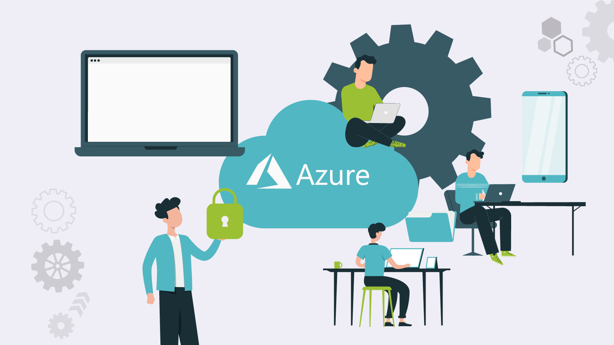

# Azure

---

## Índice de contenidos

- [Fundamentos de Cloud y Azure](#fundamentos-de-Cloud-y-Azure)
- [Roles y Seguridad en Azure](#roles-y-seguridad-en-azure)
- [Azure Blob Storage](#azure-blob-storage)
- [Azure Functions](#azure-functions)
- [Docker](#docker)
- [Azure DevOps](#azure-devops)
- [CI - Integración Continua](#ci---integración-continua)
- [CD - Despliegue Continuo](#cd---despliegue-continuo)
- [Key Vault y Gestión de Secretos](#key-vault-y-gestión-de-secretos)
- [Buenas Prácticas y Seguridad](#buenas-prácticas-y-seguridad)
- [Facturación de precios](#facturación-de-precios)

## Servicios Core

---

> Comparador de servicios con otras clouds [pulse aquí](https://comparecloud.in/)

Cheat sheet de los servicios de Azure consultar [aquí](https://tutorialsdojo.com/microsoft-azure-cheat-sheets/)

## Fundamentos de Cloud y Azure

---

Consulte la documentación del módulo [aquí](https://decidesoluciones365.sharepoint.com/:p:/r/sites/IA/_layouts/15/Doc.aspx?sourcedoc=%7BC517F7FA-626B-45F5-8F92-0BE3586D94BF%7D&file=D%C3%ADa%201_%20Fundamentos%20de%20Cloud%20y%20Azure.pptx&action=edit&mobileredirect=true)

## Roles y Seguridad en Azure

---

Consulte la documentación del módulo [aquí](https://decidesoluciones365.sharepoint.com/:p:/r/sites/IA/_layouts/15/Doc.aspx?sourcedoc=%7BB66F9CAE-06E1-496D-8E1C-24B2BE1FDF32%7D&file=Dia%202_%20Roles%20y%20Seguridad%20en%20Azure.pptx&action=edit&mobileredirect=true)

## Azure Blob Storage

---

Consulte la documentación del módulo [aquí](https://decidesoluciones365.sharepoint.com/:p:/r/sites/IA/Informacin%20comn/Charlas%20internas%20y%20Demos/Azure%20Fundamentals/Formaci%C3%B3n_Azure_Repsol/Dia%203_%20Azure%20Blob%20Storage.pptx?d=w9d19eb7c317046059ea5a1f655b87a41&csf=1&web=1&e=H4Pwnf)

## Azure Functions 

---

Consulte la documentación del módulo 
[Parte 1](https://decidesoluciones365.sharepoint.com/:p:/r/sites/IA/Informacin%20comn/Charlas%20internas%20y%20Demos/Azure%20Fundamentals/Formaci%C3%B3n_Azure_Repsol/D%C3%ADa%204_%20Azure%20Functions%20(Parte%201).pptx?d=w38074b85e3884095a16700f8e2f2aef2&csf=1&web=1&e=7sTRRf)
[Parte 2](https://decidesoluciones365.sharepoint.com/:p:/r/sites/IA/Informacin%20comn/Charlas%20internas%20y%20Demos/Azure%20Fundamentals/Formaci%C3%B3n_Azure_Repsol/D%C3%ADa%205_%20Azure%20Functions%20(Parte%202).pptx?d=w64bdffab822748f6bfcda2a0991c52f9&csf=1&web=1&e=Wx2Lft)

---

## Docker

---

Consulte la documentación del módulo [aquí](https://decidesoluciones365.sharepoint.com/:p:/r/sites/IA/Informacin%20comn/Charlas%20internas%20y%20Demos/Azure%20Fundamentals/Formaci%C3%B3n_Azure_Repsol/D%C3%ADa%206_%20Docker.pptx?d=w47dc0115ac304f93a627cdbfac5a2bf9&csf=1&web=1&e=TdXVQC)

## Azure DevOps

---

Consulte la documentación del módulo [aquí](https://decidesoluciones365.sharepoint.com/:p:/r/sites/IA/Informacin%20comn/Charlas%20internas%20y%20Demos/Azure%20Fundamentals/Formaci%C3%B3n_Azure_Repsol/D%C3%ADa%207_%20Azure%20DevOps.pptx?d=wede4e89499284ddd9624bc9869fcad80&csf=1&web=1&e=GPSZ9q)

## CI - Integración Continua
***

Consulte la documntación del módulo [aquí](https://decidesoluciones365.sharepoint.com/:p:/r/sites/IA/Informacin%20comn/Charlas%20internas%20y%20Demos/Azure%20Fundamentals/Formaci%C3%B3n_Azure_Repsol/D%C3%ADa%208_%20CI_CD%20%E2%80%94%20Integraci%C3%B3n%20Continua%20(CI).pptx?d=wbab5183107e042c3b0b4683b6ee6c3e9&csf=1&web=1&e=ASEerS)

## CD - Despliegue Continuo
***

Consulte la documentación del módulo [aquí](https://decidesoluciones365.sharepoint.com/:p:/r/sites/IA/Informacin%20comn/Charlas%20internas%20y%20Demos/Azure%20Fundamentals/Formaci%C3%B3n_Azure_Repsol/D%C3%ADa%209_%20CD%20(Despliegue%20Continuo).pptx?d=w1bae3c659d5a40f69f2b4d5ed42cee41&csf=1&web=1&e=c6HSam)

## Key Vault y Gestión de Secretos
***

Consulte la documentación del módulo [aquí](https://decidesoluciones365.sharepoint.com/:p:/r/sites/IA/Informacin%20comn/Charlas%20internas%20y%20Demos/Azure%20Fundamentals/Formaci%C3%B3n_Azure_Repsol/D%C3%ADa%2010_%20Key%20Vault%20y%20Gesti%C3%B3n%20de%20Secretos.pptx?d=w023db6d035e647088a3a90073ea560d8&csf=1&web=1&e=YITKgN)

## Buenas Prácticas y Seguridad
***

Consulte la documentación del módulo [aquí](https://decidesoluciones365.sharepoint.com/:p:/r/sites/IA/Informacin%20comn/Charlas%20internas%20y%20Demos/Azure%20Fundamentals/Formaci%C3%B3n_Azure_Repsol/D%C3%ADa%2011_%20Buenas%20Pr%C3%A1cticas%20y%20Seguridad.pptx?d=wd07ffe29a45c461685c22d28c935fc28&csf=1&web=1&e=HjbQe4)
